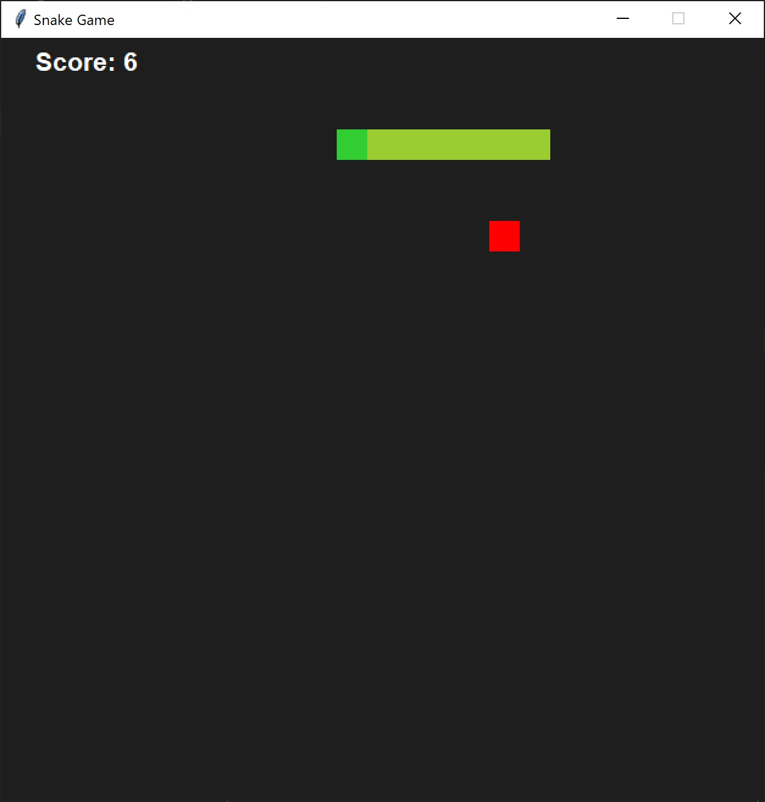

# 🐍 Snake Game in Python

A classic Snake Game built using **Python** and **Tkinter**.

## 🎮 Features

* Smooth snake movement
* Score tracking
* Collision detection
* Restart system
* Random food spawning
* Keyboard controls

## 🛠️ Technologies Used

* Python
* Tkinter

## ⌨️ Controls

| Key   | Action       |
| ----- | ------------ |
| W / ↑ | Move Up      |
| S / ↓ | Move Down    |
| A / ← | Move Left    |
| D / → | Move Right   |
| R     | Restart Game |

## ▶️ How to Run

1. Clone the repository

```bash
git clone https://github.com/Hridyansh177/Python_snake_game.git
```

2. Open the project folder

```bash
cd Python_snake_game
```

3. Run the game

```bash
python snake.py
```

## 📸 Preview




## 🚀 Future Improvements

* Start menu
* Difficulty levels
* Sound effects
* High score system
* Pause functionality


## 👨‍💻 Author

Hridyansh Sethi
